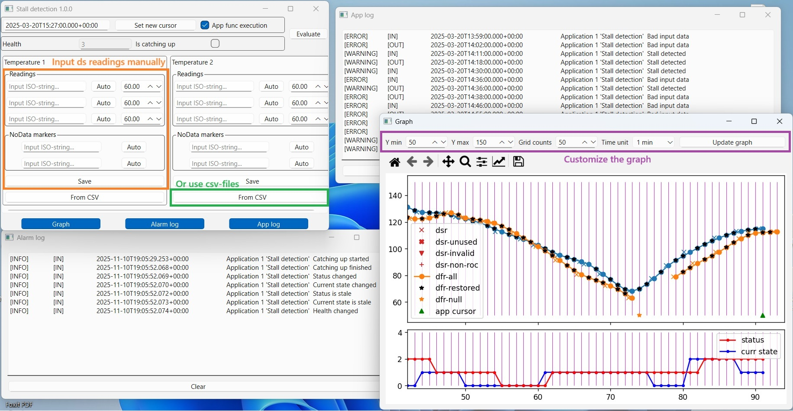

# Monapps Simulator

This is a simulator aimed at developing and testing so-called ***application functions*** for the framework that can be found here
https://github.com/DmytroIE/Monapps_v5

The simulator is based on the [PySide6](https://www.pyside.org/) Python GUI library. It implements the same functionality of creating ***datafeed readings*** and running ***application functions*** as its [elder brother](https://github.com/DmytroIE/Monapps_v5). At the same time, it simplifies the creation of fake data that is transformed into ***datastream readings*** and ***nodata markers***. Just use the buttons to generate fake data - you can create up to three ***datastream readings*** and two ***nodata markers*** for each clicking of the "Save" button, so you can add new readings in real time. If this is not an option and you need more data to play with, just prepare a set of CSV files for each datastream. See the examples in the "csv_for_tests" folder and use the same structure.

